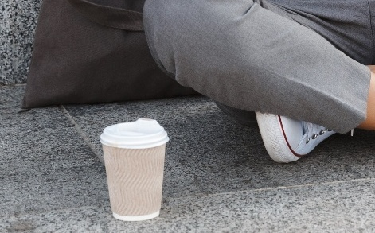

## 과제 1 이미지 불러오기 및 그레이스케일 변환
- OpenCV로 컬러 이미지를 불러오고 화면에 출력
- 원본 이미지와 그레이스케일로 변환된 이미지 나란히 표시
  
### 코드 
- 01.py

```python
import cv2 as cv
import numpy as np
import sys

# 1. cv.imread()를 사용하여 이미지 로드
img=cv.imread('./soccer.jpg')

if img is None:
    sys.exit('파일을 찾을 수 없습니다.')

# 2. cv.cvtColor() 함수를 사용해 이미지를 그레이스케일로 변환
gray=cv.cvtColor(img, cv.COLOR_BGR2GRAY)

# np.hstack()을 위해 그레이스케일 이미지를 3채널(BGR) 형식으로 변환 (차원 맞추기)
gray_3channel=cv.cvtColor(gray, cv.COLOR_GRAY2BGR)

# 3. np.hstack() 함수를 이용해 원본 이미지와 그레이스케일 이미지를 가로로 연결
combined_img=np.hstack((img, gray_3channel))

# 4. cv.imshow()와 cv.waitKey()를 사용해 결과를 표시
# cv.imshow('Original vs Grayscale', combined_img)

# 5. 이미지 사이즈를 30%로 축소 및 저장 (너무 커서 잘리는 현상 수정)
resized_img = cv.resize(combined_img, (0, 0), fx=0.3, fy=0.3)
cv.imshow('Result', resized_img)
cv.imwrite('./soccer_result.jpg', resized_img)
# 아무 키나 누르면 창이 닫히도록 설정
cv.waitKey()
cv.destroyAllWindows()```
```
### 핵심 코드 및 설명
- Grayscale 이미지 변환 및 채널 수 맞추기
  ```
  gray=cv.cvtColor(img, cv.COLOR_BGR2GRAY)
  gray_3channel=cv.cvtColor(gray, cv.COLOR_GRAY2BGR) # 흑백 이미지는 채널이 1개이므로 채널 수 3개로 통일
  ```
- 이미지 두 장을 수평으로 나란히 연결하는 함수 사용
  ```
  combined_img=np.hstack((img, gray_3channel))
  ```
-  노트북으로 실행 후 이미지 사이즈가 커서 잘리던 문제 수정
  : cv.resize() 함수사용
      

### 실행 결과


<br><br>


## 과제 2 페인팅 붓 크기 조절 기능 추가
- 이미지를 불러와 마우스 입력으로 붓질
- 키보드 입력을 통한 붓 크기 조절

### 코드 
- 02.py

```python
import cv2 as cv
import numpy as np
import sys

# 초기 설정값 정의
brush_size = 5          # 초기 붓 크기 5
Lbutton_down = False # 왼쪽 마우스 버튼 상태 체크용 변수
Rbutton_down = False # 오른쪽 마우스 버튼 상태 체크용 변수

# 마우스 콜백 함수: 이미지 위에서 마우스 동작 처리
def draw(event, x, y, flags, param):
    global brush_size, Lbutton_down, Rbutton_down

    # 왼쪽 버튼 클릭 시 파란색으로 붓질
    if event == cv.EVENT_LBUTTONDOWN:
        Lbutton_down = True # 좌클릭
        cv.circle(img, (x, y), brush_size, (255, 0, 0), -1) # 파란색(BGR)

    # 오른쪽 버튼 클릭 시 빨간색으로 붓질
    elif event == cv.EVENT_RBUTTONDOWN:
        Rbutton_down = True # 우클릭
        cv.circle(img, (x, y), brush_size, (0, 0, 255), -1) # 빨간색(BGR)

    # 마우스 드래그 시 연속해서 그리기
    elif event == cv.EVENT_MOUSEMOVE:
        if Lbutton_down:
            cv.circle(img, (x, y), brush_size, (255, 0, 0), -1)
        elif Rbutton_down:
            cv.circle(img, (x, y), brush_size, (0, 0, 255), -1)

    # 마우스 버튼을 떼면 그리기 상태 해제
    elif event == cv.EVENT_LBUTTONUP:
        Lbutton_down = False
    elif event == cv.EVENT_RBUTTONUP:
        Rbutton_down = False

# soccer.jpg 이미지 로드
img = cv.imread('./soccer.jpg')

# 파일 로드 실패 시 예외 처리
if img is None:
    sys.exit('이미지 파일을 찾을 수 없습니다.')

# 윈도우 창 생성 및 마우스 이벤트 연결
cv.namedWindow('Painting App')
cv.setMouseCallback('Painting App', draw)

# 메인 루프: 실시간으로 화면을 갱신하고 키 입력을 처리
while True:
    cv.imshow('Painting App', img)
    
    # 1ms 대기하며 키 입력 감지 (0이면 무한 대기이므로 반드시 1 이상 사용)
    key = cv.waitKey(1) & 0xFF

    # 'q'를 누르면 프로그램 종료
    if key == ord('q'):
        break
    
    # '+' 키 입력 시 붓 크기 1 증가
    elif key == ord('+'):
        brush_size = min(15, brush_size + 1)    # 최댓값 15
        print(f"현재 붓 크기: {brush_size}")

    # '-' 키 입력 시 붓 크기 1 감소
    elif key == ord('-'):
        brush_size = max(1, brush_size - 1)     # 최솟값 1
        print(f"현재 붓 크기: {brush_size}")    # 터미널에 현재 붓 크기 출력

# 모든 창을 닫고 프로그램 종료
cv.destroyAllWindows()
```
### 핵심 코드 및 설명
- 마우스 상태 변수 활용
  ```
   elif event == cv.EVENT_MOUSEMOVE: # 드래그(MOUSEMOVE)
        if Lbutton_down:
            cv.circle(img, (x, y), brush_size, (255, 0, 0), -1)
        elif Rbutton_down:
            cv.circle(img, (x, y), brush_size, (0, 0, 255), -1)
  ```
: 클릭했을 때만 점을 찍는 게 아니라,
버튼이 눌려 있는 상태를 변수로 기억해서 드래그(MOUSEMOVE) 중에도 연속해서 그릴 수 있게 함

### 실행 결과


<br><br>


## 과제 3 마우스로 영역 선택 및 ROI 추출
- 이미지를 불러오고 사용자가 마우스로 관심영역(ROI)을 선택
- 선택한 영역만 따로 저장하거나 표시

### 코드 
- 03.py

```python
import cv2 as cv
import numpy as np
import sys
from tkinter import filedialog
import tkinter as tk

# 전역 변수 초기화
is_dragging = False      # 마우스 드래그 상태 확인
start_x, start_y = -1, -1 # 사각형 시작 좌표
roi = None               # 잘라낸 관심 영역 저장 변수

# 한글 경로 문제를 해결하기 위한 이미지 읽기 함수
def imread_korean(path):
    with open(path, 'rb') as f:
        data = f.read()
    encoded_img = np.frombuffer(data, dtype=np.uint8)
    return cv.imdecode(encoded_img, cv.IMREAD_COLOR)

# 마우스 콜백 함수: 드래그로 사각형 그리기 및 ROI 지정
def on_mouse(event, x, y, flags, param):
    global is_dragging, start_x, start_y, img_display, roi

    # 왼쪽 버튼 클릭 시: 시작점 저장 및 드래그 시작
    if event == cv.EVENT_LBUTTONDOWN:
        is_dragging = True
        start_x, start_y = x, y

    # 마우스 이동 시: 드래그 중이면 실시간으로 사각형 그리기
    elif event == cv.EVENT_MOUSEMOVE:
        if is_dragging:
            img_display = img.copy() # 원본 복사하여 잔상 제거
            # cv.rectangle() 함수로 영역 시각화
            cv.rectangle(img_display, (start_x, start_y), (x, y), (0, 255, 0), 2)

    # 왼쪽 버튼을 떼었을 때: 드래그 종료 및 ROI 추출
    elif event == cv.EVENT_LBUTTONUP:
        is_dragging = False
        x1, y1 = min(start_x, x), min(start_y, y)
        x2, y2 = max(start_x, x), max(start_y, y)

        if x2 - x1 > 0 and y2 - y1 > 0:
            # ROI 추출은 numpy 슬라이싱 사용
            roi = img[y1:y2, x1:x2]
            cv.imshow('Extracted ROI', roi) # 별도의 창에 출력

# 파일 선택 창 실행
root = tk.Tk()
root.withdraw()
file_path = filedialog.askopenfilename(title="이미지 선택", filetypes=[("Images", "*.jpg *.png")])

if not file_path:
    sys.exit('파일이 선택되지 않았습니다.')

# 한글 경로 대응 함수로 이미지 로드
img = imread_korean(file_path)

if img is None:
    sys.exit('이미지를 불러올 수 없습니다. 경로를 확인하세요.')

img_display = img.copy()

cv.namedWindow('Select ROI')
cv.setMouseCallback('Select ROI', on_mouse) # 마우스 이벤트 처리 연결

print("r: 리셋, s: 저장, q: 종료")

while True:
    cv.imshow('Select ROI', img_display) # 화면 출력
    key = cv.waitKey(1) & 0xFF

    if key == ord('q'):
        break
    
    # 요구사항: r 키를 누르면 영역 선택 리셋
    elif key == ord('r'):
        img_display = img.copy()
        if cv.getWindowProperty('Extracted ROI', 0) >= 0:
            cv.destroyWindow('Extracted ROI')
        roi = None
        print("리셋되었습니다.")

    # 요구사항: s 키를 누르면 선택한 영역을 저장
    elif key == ord('s'):
        if roi is not None:
            res, encoded_img = cv.imencode('.jpg', roi)
            if res:
                with open('./extracted_roi.jpg', 'wb') as f:
                    f.write(encoded_img)
                print("저장 완료")
        else:
            print("선택된 영역이 없습니다.")

cv.destroyAllWindows()
```


<br><br>

### 실행 결과



<br><br>
