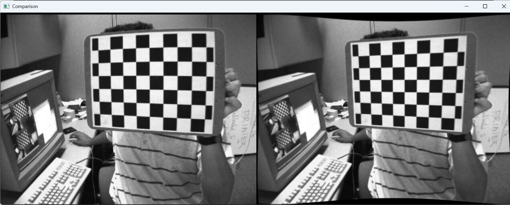
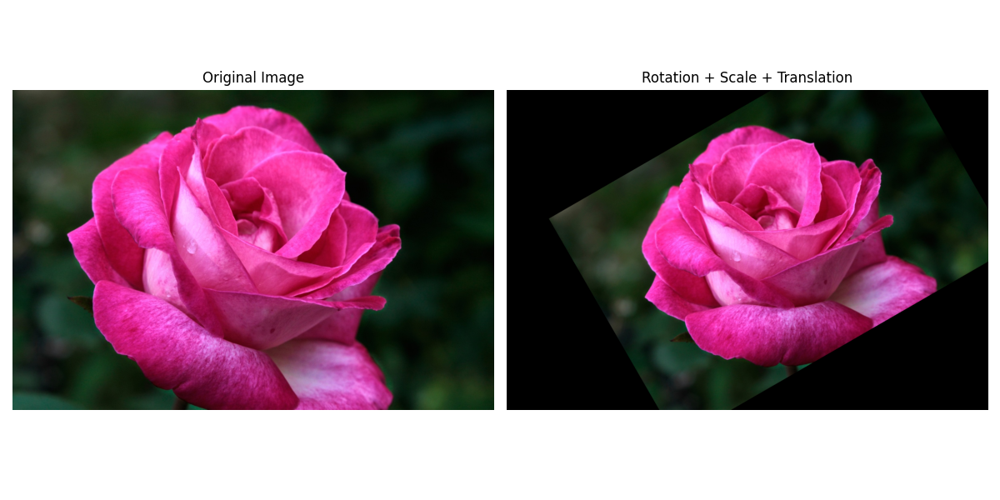
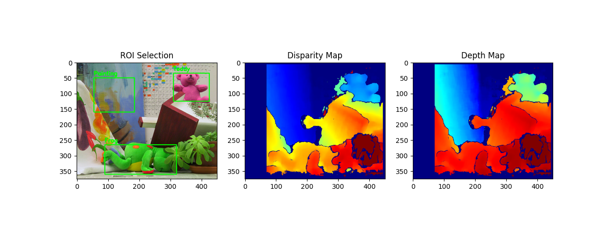

## 과제 1 체크보드 기반 카메라 캘리브레이션

  
### 코드 
- 01_calibration.py

### 실행 결과

Camera Matrix K: 
[[536.07345314   0.         342.37046827] 
 [  0.         536.01636274 235.53687064] 
 [  0.           0.           1.        ]] 
 
Distortion Coefficients: 
[[-0.26509039 -0.0467422   0.00183302 -0.00031469  0.25231221]]

  

## 과제 2 이미지 Rotation & Transformation

### 코드 
- 02_transformation.py

### 실행 결과

  

## 과제 3 Stereo Disparity 기반 Depth 추정

### 코드 
- 03_depth.py

### 실행 결과
Object     | Avg Disparity   | Avg Depth (m)   
--------------------------------------------- 
Painting   | 19.06           | 4.4248          
Frog       | 33.60           | 2.5119          
Teddy      | 22.42           | 3.8926          
 
The closest object is 'Frog', and the farthest object is 'Painting'.
 

  
