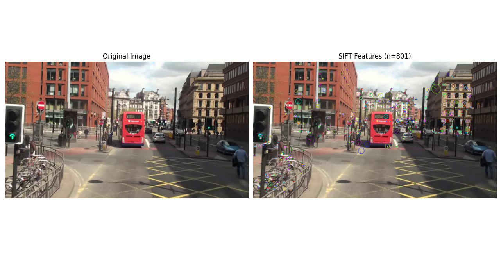
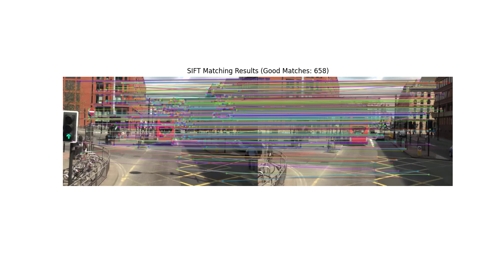
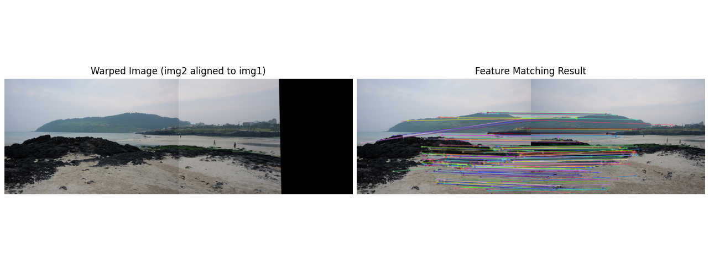

## 과제 1 SIFT를 이용한 특징점 검출 및 시각화
- 주어진 이미지(mot_color70.jpg)를 이용하여 SIFT(Scale-Invariant Feature Transform) 알고리즘을 사용하여 특징점을
검출하고 이를 시각화

### 요구사항
- cv.SIFT_create()를 사용하여 SIFT 객체를 생성
- detectAndCompute()를 사용하여 특징점을 검출
- cv.drawKeypoints()를 사용하여 특징점을 이미지에 시각화
- matplotlib을 이용하여 원본 이미지와 특징점이 시각화된 이미지를 나란히 출력

### 힌트
- SIFT_create()의 매개변수를 변경하며 특징점 검출 결과를 비교
- 특징점이 너무 많다면 nfeatures 값을 조정하여 제한
- cv.drawKeypoints()의 flags=cv.DRAW_MATCHES_FLAGS_DRAW_RICH_KEYPOINTS를 설정하면 특징점의
방향과 크기도 표시

<details>
<summary><h3><b>코드 - 1.py</b></h3></summary>
<div markdown="1">

```python
import cv2 as cv  # OpenCV 라이브러리
import numpy as np  # 수치 연산을 위한 넘파이 라이브러리
import matplotlib.pyplot as plt  # 시각화 라이브러리

# 1. 이미지 불러오기
img = cv.imread('mot_color70.jpg')  # 이미지를 BGR 형태로 읽어옴

# 이미지가 정상적으로 로드되었는지 확인
if img is None: # 이미지 로드 실패 시 None 반환
    print("이미지를 찾을 수 없습니다. 파일명을 확인하세요.")    # 에러 메시지 출력
else:
    # 2. SIFT는 그레이스케일 이미지에서 특징을 추출하므로 변환 수행
    gray = cv.cvtColor(img, cv.COLOR_BGR2GRAY)  # 컬러 이미지를 그레이스케일로 변환

    # 3. cv.SIFT_create()를 사용하여 SIFT 객체 생성
    # 힌트 반영: nfeatures를 800으로 설정하여 주요 특징점 위주로 제한 (조정 가능)
    sift = cv.SIFT_create(nfeatures=800) # 500으로 설정 후 더 촘촘한 특징점 추출 위해 800으로 조정

    # 4. detectAndCompute()를 사용하여 특징점(Keypoints)과 기술자(Descriptors) 검출
    # 기술자(des)는 이번 과제 시각화에는 쓰이지 않지만 함수 반환값이라 함께 받음
    kp, des = sift.detectAndCompute(gray, None)

    # 5. cv.drawKeypoints()를 사용하여 특징점을 이미지에 시각화
    # 힌트 반영: flags를 설정하여 특징점의 크기와 방향(Angle)까지 시각화
    img_sift = cv.drawKeypoints(img, kp, None, 
                                flags=cv.DRAW_MATCHES_FLAGS_DRAW_RICH_KEYPOINTS)

    # 6. Matplotlib을 사용하여 원본 이미지와 특징점 이미지를 나란히 출력
    plt.figure(figsize=(15, 7))  # 전체 창 크기 설정

    # --- 왼쪽: 원본 이미지 ---
    plt.subplot(1, 2, 1)  # 1행 2열 중 첫 번째
    # OpenCV(BGR)를 Matplotlib(RGB) 형식으로 변환하여 출력
    plt.imshow(cv.cvtColor(img, cv.COLOR_BGR2RGB))
    plt.title('Original Image')
    plt.axis('off')  # 축 눈금 숨기기

    # --- 오른쪽: SIFT 특징점이 표시된 이미지 ---
    plt.subplot(1, 2, 2)  # 1행 2열 중 두 번째
    plt.imshow(cv.cvtColor(img_sift, cv.COLOR_BGR2RGB))
    plt.title(f'SIFT Features (n={len(kp)})')
    # nfeatures는 엄격한 제한값이 아닌 상위 특징점 추출을 위한 '목표치'
    # 알고리즘이 특징점의 점수(Response)를 매겨 상위 순으로 추출할 때, 
    # 동일 점수를 가진 점들이 포함되거나 옥타브별 계산 과정에서 설정값보다 1~2개 더 검출될 수 있음
    plt.axis('off')

    # 7. 레이아웃 조정 및 화면 출력
    plt.tight_layout()  # 이미지 간격 겹침 방지 및 자동 정렬
    plt.show()      # 완성된 결과 창 띄우기
```

</div>
</details>

### 핵심 코드
**(1) SIFT 객체 생성 및 특징점 검출 설정**
```python
sift = cv.SIFT_create(nfeatures=800)
kp, des = sift.detectAndCompute(gray, None)
```
- nfeatures=800을 설정하여 이미지 내에서 가장 변별력이 높은 상위 800개의 특징점을 추출하도록 제한
- 이때 nfeatures는 엄격한 절댓값이 아닌 알고리즘의 '목표치'로 작용하며, 동일한 점수(Response)를 가진 특징점이 포함되거나 옥타브 연산 과정에 따라 설정값보다 1~2개 더 많은 특징점이 검출될 수 있음


**(2) RICH_KEYPOINTS를 이용한 상세 시각화**
```python
img_sift = cv.drawKeypoints(img, kp, None, flags=cv.DRAW_MATCHES_FLAGS_DRAW_RICH_KEYPOINTS)
```
- 단순히 특징점의 위치만 표시하는 것이 아니라, DRAW_RICH_KEYPOINTS 플래그를 사용하여 각 특징점의 크기(Scale)와 방향(Orientation) 정보가 포함된 원형 지표를 시각화
- 이를 통해 SIFT 알고리즘이 이미지의 크기 변화와 회전에 대해 어떻게 강인한(Invariant) 특징을 정의하는지 직관적으로 확인


### 실행 결과


<br><br>


---
## 과제 2 SIFT를 이용한 두 영상 간 특징점 매칭
- 두 개의 이미지(mot_color70.jpg, mot_color80.jpg)를 입력받아 SIFT 특징점 기반으로 매칭을 수행하고 결과를 시각화
 
### 요구사항
- cv.imread()를 사용하여 두 개의 이미지를 불러옴
- cv.SIFT_create()를 사용하여 특징점을 추출
- cv.BFMatcher() 또는 cv.FlannBasedMatcher()를 사용하여 두 영상 간 특징점을 매칭
- cv.drawMatches()를 사용하여 매칭 결과를 시각화
- matplotlib을 이용하여 매칭 결과를 출력

### 힌트
- BFMatcher(cv.NORM_L2, crossCheck=True)를 사용하면 간단한 매칭이 가능
- FLANN 기반 매칭을 원하면 cv.FlannBasedMatcher()를 사용
- knnMatch()와 DMatch 객체를 활용하여 최근접 이웃 거리 비율을 적용하면 매칭 정확도를 높일 수 있음

<details>
<summary><h3><b>코드 - 2.py</b></h3></summary>
<div markdown="1">

```python
import cv2 as cv  # OpenCV 라이브러리
import numpy as np  # 수치 연산 라이브러리
import matplotlib.pyplot as plt  # 시각화 라이브러리

# 1. 두 개의 이미지 불러오기
img1 = cv.imread('mot_color70.jpg')  # 첫 번째 이미지 (기준)
img2 = cv.imread('mot_color83.jpg')  # 두 번째 이미지 (대상)

# 이미지가 정상적으로 로드되었는지 확인
if img1 is None or img2 is None:
    print("이미지를 찾을 수 없습니다. 파일명을 확인하세요.")
else:
    # 2. SIFT 객체 생성 (기본 파라미터 사용)
    sift = cv.SIFT_create()

    # 3. 각 이미지에서 특징점(kp)과 기술자(des)를 동시에 검출
    kp1, des1 = sift.detectAndCompute(img1, None)
    kp2, des2 = sift.detectAndCompute(img2, None)

    # 4. BFMatcher 객체 생성 (SIFT는 L2 Norm을 사용함)
    # L2 Norm = 유클리드 거리 계산 방식, 제곱의 합의 루트
    # crossCheck=False로 설정하여 knnMatch를 사용 가능하게 함
    bf = cv.BFMatcher(cv.NORM_L2, crossCheck=False)

    # 5. knnMatch를 사용하여 각 특징점당 가장 유사한 2개의 매칭점 찾기
    matches = bf.knnMatch(des1, des2, k=2)

    # 6. 힌트: 최근접 이웃 거리 비율(Lowe's Ratio Test)을 적용, 매칭 정확도 향상
    # 첫 번째 매칭점이 두 번째 매칭점보다 훨씬 가까운(유사한) 경우만 선택
    good_matches = []
    for m, n in matches:
        if m.distance < 0.7 * n.distance:  # 임계값 0.7 적용
            good_matches.append(m)

    # 7. cv.drawMatches()를 사용하여 매칭 결과를 하나의 이미지로 시각화
    # flags=cv.DrawMatchesFlags_NOT_DRAW_SINGLE_POINTS: 매칭되지 않은 점은 숨김
    img_match = cv.drawMatches(img1, kp1, img2, kp2, good_matches, None, 
                               flags=cv.DrawMatchesFlags_NOT_DRAW_SINGLE_POINTS)

    # 8. Matplotlib을 사용하여 매칭 결과 출력
    plt.figure(figsize=(20, 10))
    # BGR을 RGB로 변환하여 출력
    plt.imshow(cv.cvtColor(img_match, cv.COLOR_BGR2RGB))
    plt.title(f'SIFT Matching Results (Good Matches: {len(good_matches)})')
    plt.axis('off')
    plt.show()
```

</div>
</details>

### 핵심 코드
**(1) BFMatcher와 L2 Norm**
```python
bf = cv.BFMatcher(cv.NORM_L2, crossCheck=False)
```
- BFMatcher (Brute-Force Matcher): 첫 번째 이미지의 모든 특징점 기술자와 두 번째 이미지의 모든 기술자를 일일이 전수 조사(Brute-Force)하여 가장 거리가 가까운 쌍을 찾아내는 방식
- L2 Norm(유클리디안 거리): SIFT 기술자(Descriptor)는 128차원의 실수형 벡터이므로, 두 점 사이의 직선 거리인 L2 Norm을 사용하여 유사도 측정, 거리가 짧을수록 두 특징점은 서로 닮은 것으로 판단
- crossCheck=False 설정을 통해 knnMatch에서 상위 2개의 후보군을 추출, 이후 Lowe's Ratio Test를 통한 정밀 필터링 가능

**(2) 신뢰도 확보: Lowe's Ratio Test**
```python
if m.distance < 0.7 * n.distance:
    good_matches.append(m)
```
- 가장 유사한 특징점($m$)의 거리가 두 번째로 유사한 특징점($n$)의 거리보다 70% 이상 가까운 경우에만 유효한 매칭으로 판정
- 유사도가 비슷한 모호한 특징점들을 제거, 배경의 반복 패턴 등에서 발생하는 오매칭(False Positive)을 차단하고, 매칭 결과의 정밀도를 향상시킴


### 실행 결과


<br><br>


---
## 과제 3 호모그래피를 이용한 이미지 정합 (Image Alignment)
- SIFT 특징점을 사용하여 두 이미지 간 대응점을 찾고, 이를 바탕으로 호모그래피를 계산하여 하나의 이미지 위에 정렬
- 샘플파일로 img1.jpg, imag2.jpg, imag3.jpg 중 2개를 선택

### 요구사항
- cv.imread()를 사용하여 두 개의 이미지를 불러옴
- cv.SIFT_create()를 사용하여 특징점을 검출
- cv.BFMatcher()와 knnMatch()를 사용하여 특징점을 매칭하고, 좋은 매칭점만 선별
- cv.findHomography()를 사용하여 호모그래피 행렬을 계산
- cv.warpPerspective()를 사용하여 한 이미지를 변환하여 다른 이미지와 정렬
- 변환된 이미지(Warped Image)와 특징점 매칭 결과(Matching Result)를 나란히 출력


### 힌트
- cv.findHomography()에서 cv.RANSAC을 사용하면 이상점(Outlier) 영향을 줄일 수 있음
- cv.warpPerspective()를 사용할 때 출력 크기를 두 이미지를 합친 파노라마 크기 (w1+w2, max(h1,h2))로 설정
- knnMatch()로 두 개의 최근접 이웃을 구한 뒤, 거리 비율이 임계값(예: 0.7) 미만인 매칭점만 선별


<details>
<summary><h3><b>코드 - 3.py</b></h3></summary>
<div markdown="1">

```python
import cv2 as cv  # OpenCV 라이브러리
import numpy as np  # 수치 연산 라이브러리
import matplotlib.pyplot as plt  # 시각화 라이브러리

# 1. 두 개의 이미지 불러오기
img1 = cv.imread('img1.jpg')
img2 = cv.imread('img2.jpg')

# 이미지가 정상적으로 로드되었는지 확인
if img1 is None or img2 is None:
    print("이미지를 불러올 수 없습니다.")
else:
    # 2. SIFT 특징점 및 기술자 추출
    sift = cv.SIFT_create()
    # 각 이미지에서 특징점(kp)과 기술자(des) 동시 추출
    # kp: 특징점의 위치 정보, des: 특징점 주변의 패턴 정보를 담은 128차원 벡터
    kp1, des1 = sift.detectAndCompute(img1, None)
    kp2, des2 = sift.detectAndCompute(img2, None)

    # 3. BFMatcher(Brute-Force Matcher) 객체 생성
    # cv.NORM_L2: SIFT 기술자 간의 유사도 측정 위해 L2 Norm(유클리디안 거리 방식) 사용
    bf = cv.BFMatcher(cv.NORM_L2)
    # knnMatch를 이용한 특징점 매칭: 각 특징점당 가장 유사한 2개의 매칭점 찾기 (k=2)
    matches = bf.knnMatch(des1, des2, k=2)

    # 4. Lowe's Ratio Test를 통해 좋은 매칭점(Good Matches) 선별
    good_matches = []
    for m, n in matches:
        # 첫 번째 매칭 거리(m)가 두 번째 매칭 거리(n)보다 훨씬 가까운 경우만 선택
        if m.distance < 0.7 * n.distance:   # 0.7은 힌트의 예시 반영 (경험적으로 자주 사용되는 값)
            good_matches.append(m)

    # 5. 호모그래피(Homography) 계산을 위한 좌표점 추출
    # 최소 4개 이상의 대응점 필요
    if len(good_matches) > 4:
        # 매칭된 특징점들의 좌표를 추출하여 호모그래피 함수 형식에 맞게 변환 (float32 타입 배열)
        # m.queryIdx: img1의 특징점 인덱스 / m.trainIdx: img2의 특징점 인덱스
        # reshape(-1, 1, 2): 호모그래피 계산 함수가 요구하는 넘파이 배열 차원 형식으로 변환 (N, 1, 2)  
        src_pts = np.float32([kp1[m.queryIdx].pt for m in good_matches]).reshape(-1, 1, 2)
        dst_pts = np.float32([kp2[m.trainIdx].pt for m in good_matches]).reshape(-1, 1, 2)

        # cv.findHomography(): 두 이미지 평면 사이의 3x3 투영 변환 행렬 M을 계산
        # cv.RANSAC: 잘못 매칭된 점들을 무시하고 가장 많은 점이 동의하는 변환 관계를 찾는 알고리즘
        # 5.0: RANSAC 알고리즘에서 허용하는 최대 거리 오차(임계값, 픽셀 단위)
        # dst_pts, src_pts 순서: 훈련 이미지(img2)의 좌표를 기준 이미지(img1) 좌표계로 매핑
        M, mask = cv.findHomography(dst_pts, src_pts, cv.RANSAC, 5.0)

        # 6. cv.warpPerspective(): 계산된 행렬 M을 사용하여 비틀어서 변환
        # 출력 크기는 두 이미지를 합친 넉넉한 크기로 설정 (w1+w2, h)
        h1, w1 = img1.shape[:2]
        h2, w2 = img2.shape[:2]
        res_width = w1 + w2
        res_height = max(h1, h2)
        
        # cv.warpPerspective: 투영 변환 행렬 M을 적용하여 최종 결과 이미지 생성
        # img2를 img1의 평면에 맞게 변환하여 새로운 이미지 생성 (res_width, res_height 크기)
        img2_warped = cv.warpPerspective(img2, M, (res_width, res_height))

        # img1을 왼쪽에 그대로 배치
        img2_warped[0:h1, 0:w1] = img1

        # 7. 매칭 결과 시각화 이미지 생성 (특징점끼리 선으로 연결)
        # flags=NOT_DRAW_SINGLE_POINTS: 매칭되지 않은 고립된 특징점은 그리지 않음
        img_match = cv.drawMatches(img1, kp1, img2, kp2, good_matches, None, 
                                   flags=cv.DrawMatchesFlags_NOT_DRAW_SINGLE_POINTS)

        # 8. Matplotlib을 이용한 최종 결과 시각화 출력
        plt.figure(figsize=(24, 8))  # 전체 창 크기 설정

        # 왼쪽: 호모그래피 변환 결과 (Warped Image)
        plt.subplot(1, 2, 1)    # 1행 2열 중 첫 번째 위치
        plt.imshow(cv.cvtColor(img2_warped, cv.COLOR_BGR2RGB))
        plt.title('Warped Image (img2 aligned to img1)')
        plt.axis('off')

        # 오른쪽: 특징점 매칭 결과
        plt.subplot(1, 2, 2)    # 1행 2열 중 두 번째 위치
        plt.imshow(cv.cvtColor(img_match, cv.COLOR_BGR2RGB))    # BGR을 RGB로 변환
        plt.title('Feature Matching Result')
        plt.axis('off') # 좌표축 숨김

        # 레이아웃 간격 조정 및 최종 출력
        plt.tight_layout()
        plt.show()
    else:
        # 매칭점이 4개 미만인 경우 호모그래피 계산 불가 메시지 출력
        print("매칭점이 부족하여 호모그래피를 계산할 수 없습니다.")
```

</div>
</details>

### 핵심 코드
**(1) knnMatch 및 비율 테스트를 통한 대응점 선별**
```python
# 각 특징점당 상위 2개의 유사 후보군 검출 (k=2)
matches = bf.knnMatch(des1, des2, k=2)
# Lowe's Ratio Test (임계값 0.7) 적용
if m.distance < 0.7 * n.distance:
    good_matches.append(m)
```
- 가장 유사한 특징점($m$)이 두 번째 후보($n$)보다 확연히 가까운 경우에만 유효한 매칭으로 인정 (0.7 이내)
- 배경의 반복 패턴 등에서 발생하는 모호한 매칭(False Positive)을 사전에 차단, 이후 호모그래피 행렬 계산의 기초가 되는 대응점들의 신뢰도를 확보

**(2) RANSAC 기반 호모그래피(Homography) 추정**
```python
# dst_pts(img2)를 src_pts(img1) 좌표계로 매핑하기 위한 행렬 계산
M, mask = cv.findHomography(dst_pts, src_pts, cv.RANSAC, 5.0)
```
- RANSAC 알고리즘을 적용하여 잘못 매칭된 이상치(Outlier)를 배제하고, 거리 오차 5.0 픽셀 이내의 유효한 대응점들로만 정밀한 변환 행렬을 산출
- 변환 행렬($M$)은 두 이미지 평면 사이의 기하학적 투영 관계를 나타냄


**(3) Perspective Warping 및 이미지 정합(Alignment)**
```python
# img2를 img1 평면에 맞게 투영 변환
img2_warped = cv.warpPerspective(img2, M, (res_width, res_height))
# 변환된 도화지 상의 (0,0) 위치에 기준 영상(img1) 배치
img2_warped[0:h1, 0:w1] = img1
```
- cv.warpPerspective(): 산출된 행렬 $M$을 이용하여 img2의 시점을 img1과 일치하도록 기하학적으로 변환(Warping)
- 서로 다른 각도에서 촬영된 두 이미지의 좌표계를 하나로 통합하여, 자연스럽게 이어진 파노라마(Stitching) 결과물을 생성


### 실행 결과


<br><br>

