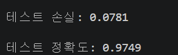
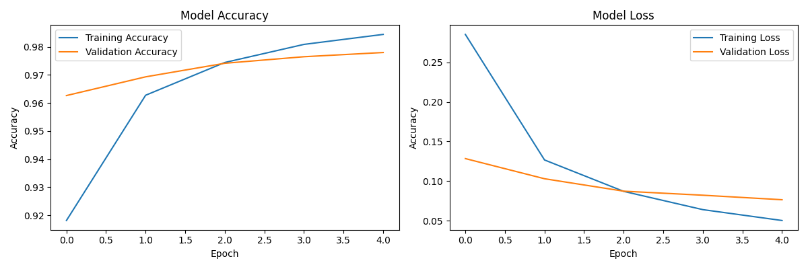
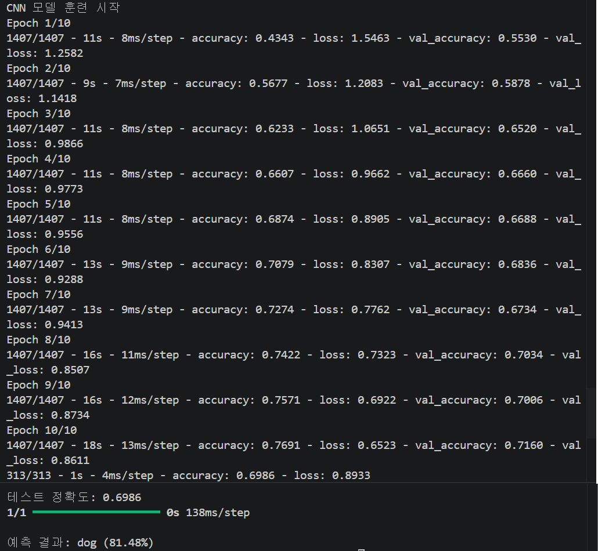

## 과제 1 간단한 이미지 분류기 구현
- 손글씨 숫자 이미지(MNIST 데이터셋)를 이용하여 간단한 이미지 분류기를 구현

### 요구사항
- MNIST 데이터셋을 로드
- 데이터를 훈련 세트와 테스트 세트로 분할
- 간단한 신경망 모델을 구축
- 모델을 훈련시키고 정확도를 평가

### 힌트
- tensorflow.keras.datasets에서 MNIST 데이터셋을 불러올 수 있음
- Sequential 모델과 Dense 레이어를 활용하여 신경망을 구성
- 손글씨 숫자 이미지는 28x28 픽셀 크기의 흑백 이미지

<details>
<summary><h3><b>코드 - 1.py</b></h3></summary>
<div markdown="1">

```python
import tensorflow as tf
from tensorflow.keras import layers, models
from tensorflow.keras.datasets import mnist
import matplotlib.pyplot as plt

# 1. MNIST 데이터셋 로드 및 전처리
# load_data()를 통해 훈련용(train)과 검증용(test) 데이터 및 레이블을 자동으로 분할하여 로드
(x_train, y_train), (x_test, y_test) = mnist.load_data()

# 0~255 사이의 픽셀 값을 0~1 사이로 정규화 (Normalization)
x_train, x_test = x_train / 255.0, x_test / 255.0

# 2. Sequential 모델 구축
model = models.Sequential([
    layers.Flatten(input_shape=(28, 28)),   # 28x28 2차원 배열을 1차원 벡터로 평탄화
    layers.Dense(128, activation='relu'),   # 은닉층: 128개의 노드와 ReLU 활성화 함수 사용
    layers.Dense(10, activation='softmax')  # 출력층: 10개 숫자(0~9) 분류를 위해 10개 노드와 Softmax 사용
])

# 3. 모델 컴파일
model.compile(optimizer='adam',                          # 효율적인 가중치 업데이트를 위한 Adam 옵티마이저 사용
              loss='sparse_categorical_crossentropy',    # 다중 분류를 위한 손실 함수 설정 (정수형 레이블용)
              metrics=['accuracy'])                      # 평가 지표로 정확도(Accuracy)를 모니터링함

# 4. 모델 훈련 (5회 반복)
# validation_split=0.1: 훈련 데이터의 10%를 검증용으로 사용하여 학습 중 과적합 여부 확인
# epochs=5: 전체 데이터셋을 총 5회 반복 학습함
# verbose=2: 에폭당 학습 진행 상황을 한 줄씩 요약하여 터미널에 표시
history = model.fit(x_train, y_train, validation_split=0.1, epochs=5, verbose=2)

# 5. 모델 정확도 평가
# 학습에 사용되지 않은 테스트 데이터셋(x_test, y_test)을 넣어 최종 성능 측정
test_loss, test_acc = model.evaluate(x_test, y_test, verbose=2)
# 측정된 손실값과 정확도를 소수점 4자리까지 출력
print(f'\n테스트 손실: {test_loss:.4f}')
print(f'\n테스트 정확도: {test_acc:.4f}')

# 6. 훈련 과정 시각화
plt.figure(figsize=(12, 4))    # 그래프 전체 크기 설정 (가로 12, 세로 4)

# 정확도 그래프: 1행 2열 중 첫 번째 위치에 배치
plt.subplot(1, 2, 1)
plt.plot(history.history['accuracy'], label='Training Accuracy')          # 훈련 데이터 정확도 변화
plt.plot(history.history['val_accuracy'], label='Validation Accuracy')    # 검증 데이터 정확도 변화
plt.title('Model Accuracy')    # 그래프 제목
plt.xlabel('Epoch')            # x축 라벨 (학습 횟수)
plt.ylabel('Accuracy')         # y축 라벨 (정확도 비율)
plt.legend()                   # 범례 표시

# 손실 그래프: 1행 2열 중 두 번째 위치에 배치
plt.subplot(1, 2, 2)
plt.plot(history.history['loss'], label='Training Loss')            # 훈련 데이터 손실 값 변화
plt.plot(history.history['val_loss'], label='Validation Loss')      # 검증 데이터 손실 값 변화
plt.title('Model Loss')        # 그래프 제목
plt.xlabel('Epoch')            # x축 라벨 (학습 횟수)
plt.ylabel('Accuracy')         # y축 라벨 (오차 값)
plt.legend()                   # 범례 표시

plt.tight_layout()             # 그래프 요소들이 겹치지 않도록 레이아웃 자동 조정
plt.show()                     # 생성된 그래프를 화면에 출력
```

</div>
</details>

### 핵심 코드
**Sequential 모델 설계 및 레이어 구성**
```python
model = models.Sequential([
    layers.Flatten(input_shape=(28, 28)),   # 28x28 2차원 배열을 1차원 벡터로 평탄화
    layers.Dense(128, activation='relu'),   # 은닉층: 128개의 노드와 ReLU 활성화 함수 사용
    layers.Dense(10, activation='softmax')  # 출력층: 10개 숫자(0~9) 분류를 위해 10개 노드와 Softmax 사용
])
```
- 데이터 변환: 28x28 형태의 2차원 행렬 데이터를 신경망이 처리할 수 있는 1차원 데이터(784개)로 평탄화(Flatten)하는 필수 전처리 과정
- 특징 학습: ReLU 활성화 함수를 사용해 신경망의 고질적인 문제인 기울기 소실(Vanishing Gradient)을 방지하며 효과적으로 이미지의 특징을 학습
- 확률 기반 분류: 마지막 층에 Softmax를 적용하여 출력값을 '단순 수치'가 아닌 '각 숫자(0~9)일 확률'로 변환함으로써, 다중 클래스 분류의 최종 결론을 도출


### 실행 결과


<br><br>


<br>


---
## 과제 2 CIFAR-10 데이터셋을 활용한 CNN 모델 구축
- CIFAR-10 데이터셋을 활용하여 합성곱 신경망(CNN)을 구축하고 이미지 분류를 수행

### 요구사항
- CIFAR-10 데이터셋을 로드
- 데이터 전처리(정규화 등)를 수행
- CNN 모델을 설계하고 훈련
- 모델의 성능을 평가하고, 테스트 이미지(dog.jpg)에 대한 예측을 수행

### 힌트
- tensorflow.keras.datasets에서 CIFAR-10 데이터셋을 불러올 수 있음
- Conv2D, MaxPooling2D, Flatten, Dense 레이어를 활용하여 CNN을 구성
- 데이터 전처리 시 픽셀 값을 0~1 범위로 정규화하면 모델의 수렴이 빨라질 수 있음


<details>
<summary><h3><b>코드 - 2.py</b></h3></summary>
<div markdown="1">

```python
import tensorflow as tf
from tensorflow.keras import layers, models, datasets
import numpy as np
import cv2 as cv

# 1. CIFAR-10 데이터셋 로드 및 전처리
# cifar10.load_data()를 통해 10개 카테고리의 컬러 이미지 데이터를 로드
(x_train, y_train), (x_test, y_test) = datasets.cifar10.load_data()

# 픽셀 값 정규화 (0~1 범위)
x_train, x_test = x_train / 255.0, x_test / 255.0

# 클래스 이름 정의
# 예측 시 숫자로 나오는 인덱스 결과를 실제 사물 이름으로 매핑하기 위한 리스트 정의
class_names = ['airplane', 'automobile', 'bird', 'cat', 'deer', 
               'dog', 'horse', 'ship', 'truck', 'frog']

# 2. CNN 모델 설계
model = models.Sequential([
    # 특징 추출부 (Convolutional Base): 이미지의 공간적 특징 학습
    # 3x3 크기의 필터 32개를 사용하여 특징 추출, 입력 크기는 32x32 픽셀의 RGB(3) 컬러 이미지
    layers.Conv2D(32, (3, 3), activation='relu', input_shape=(32, 32, 3)),
    # 2x2 영역에서 최대값을 뽑아내 이미지 크기를 줄이고 주요 특징만 보존 (다운샘플링)
    layers.MaxPooling2D((2, 2)),
    # 더 깊은 수준의 특징 추출을 위해 64개의 필터를 가진 합성곱 층 추가
    layers.Conv2D(64, (3, 3), activation='relu'),
    # 이미지의 공간적 크기를 다시 줄여 계산량 감소 및 특징 요약
    layers.MaxPooling2D((2, 2)),
    # 마지막 합성곱 층을 통해 복잡한 시각적 패턴 학습
    layers.Conv2D(64, (3, 3), activation='relu'),
    
    # 분류부 (Classifier): 추출된 특징을 바탕으로 사물 분류 수행
    # 3차원의 특징 맵 데이터를 1차원의 벡터 형태로 변환
    layers.Flatten(),
    # 64개의 노드를 가진 완전 연결층을 통해 고차원적 특징 통합 학습
    layers.Dense(64, activation='relu'),
    # 최종 출력층: 10개 클래스 각각에 대한 확률을 Softmax 함수로 산출
    layers.Dense(10, activation='softmax') 
])

# 3. 모델 컴파일 및 훈련
# Adam 옵티마이저와 다중 분류용 손실 함수 설정
model.compile(optimizer='adam',
              loss='sparse_categorical_crossentropy',
              metrics=['accuracy'])

print("CNN 모델 훈련 시작")
# 전체 데이터를 10회 반복 학습하며, 훈련 데이터의 10%를 검증용으로 활용
model.fit(x_train, y_train, epochs=10, validation_split=0.1, verbose=2)

# 4. 모델 성능 평가
# 학습에 사용되지 않은 테스트 데이터를 통해 최종 일반화 성능 측정
test_loss, test_acc = model.evaluate(x_test, y_test, verbose=2)
# 최종 테스트 정확도를 소수점 4자리까지 출력
print(f'\n테스트 정확도: {test_acc:.4f}')

# 5. 이미지(dog.jpg) 예측 수행
try:
    # 이미지 로드
    img = cv.imread('dog.jpg')
    img_rgb = cv.cvtColor(img, cv.COLOR_BGR2RGB) # OpenCV의 BGR -> 모델 학습 기준 RGB 배열로 변환
    img_resized = cv.resize(img_rgb, (32, 32))   # 모델 입력 규격인 32x32 픽셀 크기로 이미지 사이즈 조절
    img_normalized = img_resized / 255.0         # 예측을 위해 픽셀 값을 0~1 사이로 정규화
    img_input = np.expand_dims(img_normalized, axis=0) # 4차원 배열로 변환 (1, 32, 32, 3)

    # 학습된 모델을 사용하여 해당 이미지의 클래스별 확률 예측
    predictions = model.predict(img_input)
    # 10개의 확률 값 중 가장 높은 값을 가진 인덱스 추출
    score = np.argmax(predictions)

    # 클래스 이름 리스트와 확률값을 이용하여 최종 결과 출력
    print(f"\n예측 결과: {class_names[score]} ({predictions[0][score]*100:.2f}%)")
except Exception as e:
    # 파일이 없거나 전처리 과정에서 문제 발생 시 오류 메시지 출력
    print(f"\n이미지 예측 중 오류 발생: {e}")
```

</div>
</details>

### 핵심 코드
**(1) CNN 모델 설계 중 특징 추출부 (Convolutional Base)**
```python
# Conv2D로 특징 추출 후 MaxPooling2D로 데이터 압축 및 주요 정보 보존
# (1) 3x3 크기의 필터 32개를 사용하여 특징 추출, 입력 크기는 32x32 픽셀의 RGB(3) 컬러 이미지
layers.Conv2D(32, (3, 3), activation='relu', input_shape=(32, 32, 3)),
# (2) 2x2 영역에서 최대값을 뽑아내 이미지 크기를 줄이고 주요 특징만 보존 (다운샘플링)
layers.MaxPooling2D((2, 2)),
# (3) 더 깊은 수준의 특징 추출을 위해 64개의 필터를 가진 합성곱 층 추가
layers.Conv2D(64, (3, 3), activation='relu'),
# (4) 이미지의 공간적 크기를 다시 줄여 계산량 감소 및 특징 요약
layers.MaxPooling2D((2, 2)),
# (5) 마지막 합성곱 층을 통해 복잡한 시각적 패턴 학습
layers.Conv2D(64, (3, 3), activation='relu')
```
- 원리: Conv2D 필터가 이미지의 엣지, 질감 등 공간적 특징을 추출하고, MaxPooling2D로 특징 맵(피처 맵)의 크기를 축소하여 주요 정보는 보존하면서 연산 효율성을 높임.
- 효과: 데이터를 일렬로 나열하는 단순 신경망(MLP)보다 컬러 이미지의 기하학적 구조를 효과적으로 파악하여, 복잡한 사물에 대한 분류 성능을 극대화. 


**(2) 외부 이미지 예측을 위한 데이터 차원 확장**
```python
# 단일 이미지를 모델 입력 규격(Batch Size 포함 4차원)에 맞춰 4차원 배열로 변환
img_input = np.expand_dims(img_normalized, axis=0) # (32, 32, 3) -> (1, 32, 32, 3)
```
- 원리: Keras 모델은 입력 데이터의 첫 번째 차원을 배치 크기(Batch Size)로 정의함. np.expand_dims를 통해 단일 이미지 데이터에 축(Axis)을 추가하여 차원을 일치시킴.
- 효과: 개별 이미지 데이터를 모델의 추론(Inference) 파이프라인에 적합한 구조로 변형하여, 실전 데이터에 대한 분류 예측을 정상적으로 수행.

  
### 실행 결과
- 테스트 정확도: 0.6986
- 예측 결과: dog (81.48%)
  

<br><br>


