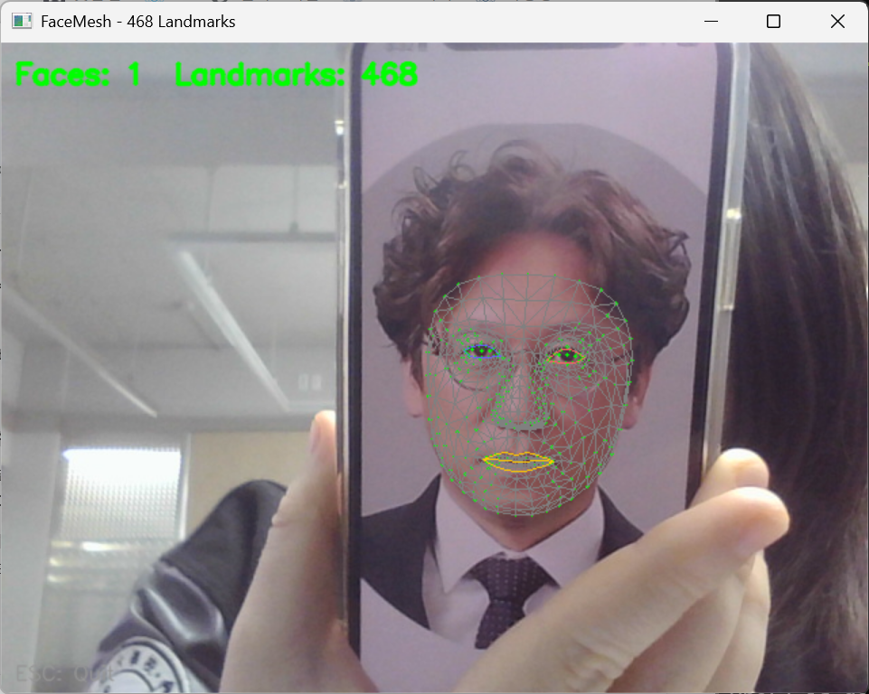

## 과제 1 SORT 알고리즘을 활용한 다중 객체 추적기 구현
- SORT 알고리즘을 사용하여 비디오에서 다중 객체를 실시간으로 추적하는 프로그램을 구현
- 이를 통해 객체 추적의 기본 개념과 SORT 알고리즘의 적용 방법을 학습

### 요구사항
- 객체 검출기 구현: YOLOv3와 같은 사전 훈련된 객체 검출 모델을 사용하여 각 프레임에서 객체를 검출합니다.
• mathworks.comSORT 추적기 초기화: 검출된 객체의 경계 상자를 입력으로 받아 SORT 추적기를 초기화합니다.
• 객체 추적: 각 프레임마다 검출된 객체와 기존 추적 객체를 연관시켜 추적을 유지합니다.
• 결과 시각화: 추적된 각 객체에 고유 ID를 부여하고, 해당 ID와 경계 상자를 비디오 프레임에 표시하여 실시간으로 출력합니다.

### 힌트
- 객체 검출: OpenCV의 DNN 모듈을 사용하여 YOLOv3 모델을 로드하고, 각 프레임에서 객체를 검출할 수 있습니다.
- SORT 알고리즘: SORT 알고리즘은 칼만 필터와 헝가리안 알고리즘을 사용하여 객체의 상태를 예측하고, 데이터 연관을 수행합니다.
- 추적 성능 향상: 객체의 appearance 정보를 활용하는 Deep SORT와 같은 확장된 알고리즘을 사용하면 추적 성능을 향상시킬 수 있습니다.

<details>
<summary><h3><b>코드 - 1.py</b></h3></summary>
<div markdown="1">

```python
import cv2 # 비디오 및 이미지 처리를 위한 OpenCV
import numpy as np # 수치 연산을 위한 넘파이
import os # 파일 경로 확인용
from sort import SORT # 직접 분리해 만든 SORT 추적 알고리즘 클래스 임포트

# COCO 데이터셋 기본 클래스 이름 리스트
COCO_NAMES = ["person","bicycle","car","motorbike","aeroplane","bus","train","truck","boat","traffic light"]

# ─────────────────────────────────────────────────────────
# 1. YOLOv3 객체 검출기
# ─────────────────────────────────────────────────────────
class YOLOv3Detector:
    def __init__(self, cfg="yolov3.cfg", weights="yolov3.weights", names="coco.names", conf_thresh=0.4, nms_thresh=0.4):
        # 파일이 존재하면 읽어서 리스트로 만들고, 없으면 기본 COCO_NAMES 사용
        self.classes = [l.strip() for l in open(names).readlines()] if os.path.exists(names) else COCO_NAMES
        # 다크넷(Darknet) 기반의 YOLOv3 설정 및 가중치 파일을 OpenCV DNN 네트워크로 로드
        self.net = cv2.dnn.readNetFromDarknet(cfg, weights)
        self.net.setPreferableBackend(cv2.dnn.DNN_BACKEND_OPENCV) # 백엔드로 OpenCV 선택
        self.net.setPreferableTarget(cv2.dnn.DNN_TARGET_CPU)      # CPU 환경에서 동작하도록 설정
        
        layer_names = self.net.getLayerNames() # 네트워크의 모든 레이어 이름 가져오기
        out_idx = self.net.getUnconnectedOutLayers() # 최종 출력 레이어의 인덱스 확인
        # OpenCV 버전에 따른 차이 처리 후 출력 레이어 이름 추출
        self.output_layers = [layer_names[i[0] - 1] if isinstance(out_idx[0], (list, np.ndarray)) else layer_names[i - 1] for i in out_idx]
        # 객체 신뢰도 임계값, NMS 임계값, YOLOv3 입력 권장 사이즈(416x416) 설정
        self.conf_thresh, self.nms_thresh, self.input_size = conf_thresh, nms_thresh, (416, 416)

    def detect(self, frame):
        H, W = frame.shape[:2] # 원본 프레임의 높이와 너비
        # 이미지를 YOLO 모델이 받아들일 수 있는 정규화된 4차원 블롭(Blob) 형태로 변환
        blob = cv2.dnn.blobFromImage(frame, 1/255.0, self.input_size, swapRB=True, crop=False)
        self.net.setInput(blob) # 네트워크 입력 설정
        layer_outputs = self.net.forward(self.output_layers) # 순전파(Forward) 연산 실행하여 결과 도출

        boxes, scores, class_ids = [], [], []
        for output in layer_outputs:
            for det in output:
                confs = det[5:] # 처음 5개(x,y,w,h,물체확률) 이후의 값들이 클래스별 확률
                cid = int(np.argmax(confs)) # 가장 확률이 높은 클래스의 인덱스 추출
                conf = float(confs[cid])    # 그 클래스의 확률값 추출
                # 확률값이 임계값(0.4)보다 높은 유효한 검출만 사용
                if conf > self.conf_thresh:
                    # 0~1 사이의 비율로 나온 박스 크기를 원본 이미지 크기 픽셀값으로 복원
                    cx, cy, w, h = det[0]*W, det[1]*H, det[2]*W, det[3]*H
                    # 중심 좌표를 좌상단 좌표로 변환하여 저장
                    boxes.append([int(cx - w / 2), int(cy - h / 2), int(w), int(h)])
                    scores.append(conf)
                    class_ids.append(cid)

        # NMS(Non-Maximum Suppression): 같은 객체에 여러 박스가 겹쳐 쳐진 경우 가장 확률이 높은 박스 하나만 남김
        indices = cv2.dnn.NMSBoxes(boxes, scores, self.conf_thresh, self.nms_thresh)
        if len(indices) == 0: return [], [], [] # 남은 박스가 없으면 빈 리스트 반환
        # OpenCV 버전 호환성을 위해 리스트 평탄화
        indices = [i[0] for i in indices] if isinstance(indices[0], (list, np.ndarray)) else list(indices.flatten())
        
        # NMS를 통과한 최종 박스, 신뢰도, 클래스 ID만 추려서 반환
        return [boxes[i] for i in indices], [scores[i] for i in indices], [class_ids[i] for i in indices]

# ─────────────────────────────────────────────────────────
# 2. 시각화 함수
# ─────────────────────────────────────────────────────────
def draw_results(frame, results, show_traj):
    # 추적기에서 반환된 각 객체 정보(박스, ID, 클래스명, 궤적)를 순회하며 화면에 그리기
    for bbox, tid, cls_name, history in results:
        x, y, w, h = (int(v) for v in bbox) # 박스 좌표를 정수형으로 변환
        np.random.seed(tid * 7 + 13) # ID 기반으로 일정한 색상이 나오도록 랜덤 시드 고정
        color = tuple(int(c) for c in np.random.randint(80, 255, 3)) # 고유한 BGR 색상 생성

        # 프레임에 객체의 경계 상자 그리기
        cv2.rectangle(frame, (x, y), (x+w, y+h), color, 2)
        # ID 번호와 클래스 이름 텍스트 생성 및 박스 위쪽에 표시
        label = f"ID:{tid} {cls_name}"
        cv2.putText(frame, label, (x, y-5), cv2.FONT_HERSHEY_SIMPLEX, 0.5, color, 2)

        # 궤적 표시 옵션이 켜져 있고 이전 기록이 있을 경우
        if show_traj and len(history) > 1:
            # 궤적 리스트에 있는 과거 중심점들을 선으로 연결하여 이동 경로를 표시
            for k in range(1, len(history)):
                p1 = (int(history[k-1][0]+history[k-1][2]/2), int(history[k-1][1]+history[k-1][3]/2))
                p2 = (int(history[k][0]+history[k][2]/2), int(history[k][1]+history[k][3]/2))
                cv2.line(frame, p1, p2, color, 2)

# ─────────────────────────────────────────────────────────
# 3. 메인 실행 루프
# ─────────────────────────────────────────────────────────
def main():
    # 검출기와 추적기 객체 초기화 (설정값 적용)
    detector = YOLOv3Detector(cfg="yolov3.cfg", weights="yolov3.weights")
    tracker = SORT(max_age=3, min_hits=2, iou_threshold=0.3)
    
    # 분석할 비디오 파일 로드
    cap = cv2.VideoCapture("slow_traffic_small.mp4")
    show_traj = True # 궤적 그리기 모드 기본 ON

    while cap.isOpened():
        ret, frame = cap.read() # 프레임 한 장씩 읽기
        if not ret: break       # 영상이 끝나면 루프 종료

        # 1. YOLOv3를 통해 현재 프레임의 모든 객체 검출
        boxes, _, class_ids = detector.detect(frame)
        # 숫자로 된 클래스 ID를 사람이 읽을 수 있는 이름('car', 'person' 등)으로 변환
        class_names = [detector.classes[c] if 0 <= c < len(detector.classes) else "obj" for c in class_ids]

        # 2. 검출된 정보를 SORT 알고리즘에 넘겨 ID 부여 및 위치 추적 업데이트
        results = tracker.update(boxes, class_ids, class_names)

        # 3. 업데이트된 추적 결과를 영상 프레임 위에 시각화
        draw_results(frame, results, show_traj)
        # 좌상단 타이틀 텍스트 추가
        cv2.putText(frame, "SORT Tracker", (10, 30), cv2.FONT_HERSHEY_SIMPLEX, 1, (0, 255, 0), 2)
        
        # 처리된 프레임을 화면에 출력
        cv2.imshow("Multi-Object Tracking", frame)

        # 키보드 입력 대기 및 제어 (q: 종료, s: 궤적 표시 토글)
        key = cv2.waitKey(1) & 0xFF
        if key == ord('q'): break
        elif key == ord('s'): show_traj = not show_traj

    # 메모리 해제 및 모든 창 닫기
    cap.release()
    cv2.destroyAllWindows()

# 프로그램 시작점 지정
if __name__ == "__main__":
    main()
```

</div>
</details>


<details>
<summary><h3><b>코드 - sort.py</b></h3></summary>
<div markdown="1">

```python
import cv2 # 칼만 필터 기능 사용을 위한 OpenCV 임포트
import numpy as np # 행렬 및 수치 연산을 위한 넘파이 임포트
from scipy.optimize import linear_sum_assignment # 헝가리안 매칭 알고리즘 함수 임포트

# ─────────────────────────────────────────────────────────
# 1. IoU 계산 (Intersection over Union: 두 박스가 겹치는 비율)
# ─────────────────────────────────────────────────────────
def compute_iou_matrix(trackers, detections):
    # [x, y, w, h] 형식을 좌표 중심의 [x1, y1, x2, y2]로 변환하는 내부 함수
    def to_xyxy(b):
        return [b[0], b[1], b[0]+b[2], b[1]+b[3]]

    # 트랙(기존 객체) 개수 행, 검출(새 객체) 개수 열을 가진 빈 IoU 행렬 생성
    iou = np.zeros((len(trackers), len(detections)), dtype=np.float32)
    for i, t in enumerate(trackers):
        t = to_xyxy(t) # 트랙 박스 좌표 변환
        for j, d in enumerate(detections):
            d = to_xyxy(d) # 검출 박스 좌표 변환
            # 두 박스가 겹치는 교집합 영역의 좌상단, 우하단 좌표 계산
            xi1, yi1 = max(t[0], d[0]), max(t[1], d[1])
            xi2, yi2 = min(t[2], d[2]), min(t[3], d[3])
            # 교집합 면적 계산 (겹치지 않으면 0)
            inter = max(0, xi2-xi1) * max(0, yi2-yi1)
            # 합집합 면적 = (트랙 면적) + (검출 면적) - (교집합 면적)
            union = ((t[2]-t[0])*(t[3]-t[1]) + (d[2]-d[0])*(d[3]-d[1]) - inter)
            # IoU 비율 계산 및 행렬에 저장
            iou[i, j] = inter / union if union > 0 else 0
    return iou

# ─────────────────────────────────────────────────────────
# 2. 칼만 필터 트랙 (개별 객체의 상태 관리)
# ─────────────────────────────────────────────────────────
class KalmanBoxTracker:
    count = 0 # 모든 객체에 부여될 고유 ID 카운터 (전역 변수)

    def __init__(self, bbox):
        # 8개의 상태(x,y,w,h, vx,vy,vw,vh)와 4개의 관측값(x,y,w,h)을 가지는 칼만 필터 생성
        self.kf = cv2.KalmanFilter(8, 4)
        # 상태 전이 행렬 (등속도 운동 모델: 다음 위치 = 현재 위치 + 속도)
        self.kf.transitionMatrix = np.array([
            [1,0,0,0, 1,0,0,0], [0,1,0,0, 0,1,0,0], [0,0,1,0, 0,0,1,0], [0,0,0,1, 0,0,0,1],
            [0,0,0,0, 1,0,0,0], [0,0,0,0, 0,1,0,0], [0,0,0,0, 0,0,1,0], [0,0,0,0, 0,0,0,1]
        ], dtype=np.float32)
        # 관측 행렬 (실제 측정된 4개의 위치 및 크기 정보만 반영)
        self.kf.measurementMatrix = np.eye(4, 8, dtype=np.float32)
        # 시스템(예측) 노이즈 공분산 설정
        self.kf.processNoiseCov = np.eye(8, dtype=np.float32) * 1e-2
        # 측정(검출기) 노이즈 공분산 설정
        self.kf.measurementNoiseCov = np.eye(4, dtype=np.float32) * 1e-1
        # 초기 오차 공분산 설정 (처음엔 불확실성이 크므로 큰 값 부여)
        self.kf.errorCovPost = np.eye(8, dtype=np.float32) * 10
        # 검출된 초기 박스 위치로 칼만 필터 상태 초기화
        self.kf.statePost = np.array([bbox[0], bbox[1], bbox[2], bbox[3], 0, 0, 0, 0], dtype=np.float32).reshape(8, 1)

        KalmanBoxTracker.count += 1      # 새 객체 생성 시 전체 ID 카운터 1 증가
        self.id = KalmanBoxTracker.count # 현재 객체에 고유 ID 부여
        # 상태 추적용 변수들 (히트 수, 연속 히트 수, 업데이트 안된 시간, 나이) 초기화
        self.hits, self.hit_streak, self.time_since_update, self.age = 1, 1, 0, 0
        self.history = []                # 객체의 이동 궤적을 저장할 리스트
        self.class_id, self.class_name = -1, "unknown" # 클래스 정보 초기화

    def predict(self):
        # 칼만 필터 수학 모델을 통해 현재 프레임의 위치 예측
        pred = self.kf.predict()
        self.age += 1                # 객체 나이 증가
        self.time_since_update += 1  # 업데이트 안된 시간 1 증가 (이후 매칭되면 0으로 리셋됨)
        bbox = pred[:4].flatten()    # 예측된 [x, y, w, h] 값 추출
        self.history.append(bbox.copy()) # 궤적 리스트에 현재 위치 저장
        # 궤적이 너무 길어지지 않도록 최근 40프레임 위치만 보존
        if len(self.history) > 40: self.history.pop(0)
        return bbox

    def update(self, bbox, class_id=-1, class_name="unknown"):
        # 실제 검출(YOLO) 결과로 칼만 필터 상태를 정밀하게 보정
        self.time_since_update = 0   # 매칭 성공했으므로 업데이트 시간 0으로 리셋
        self.hits += 1               # 총 히트 수 증가
        self.hit_streak += 1         # 연속 히트 수 증가
        self.class_id, self.class_name = class_id, class_name # 클래스 정보 갱신
        self.kf.correct(np.array(bbox, dtype=np.float32).reshape(4, 1)) # 실제 측정값으로 보정 수행

    def get_state(self):
        # 현재 추정된 가장 정확한 객체의 [x, y, w, h] 상태 반환
        return self.kf.statePost[:4].flatten()

# ─────────────────────────────────────────────────────────
# 3. SORT 알고리즘 본체 (다중 객체 관리 및 데이터 연관)
# ─────────────────────────────────────────────────────────
class SORT:
    def __init__(self, max_age=3, min_hits=2, iou_threshold=0.3):
        self.max_age = max_age             # 객체가 검출되지 않아도 ID를 유지할 최대 프레임 수
        self.min_hits = min_hits           # 추적 결과를 화면에 표시하기 위한 최소 연속 검출 횟수
        self.iou_threshold = iou_threshold # 겹침 비율이 이 값 이상일 때만 동일 객체로 매칭 허용
        self.trackers = []                 # 현재 추적 중인 모든 칼만 필터 객체들을 담을 리스트
        self.frame_count = 0               # 전체 프레임 카운터

    def update(self, detections, class_ids=None, class_names=None):
        self.frame_count += 1
        # 클래스 정보가 없을 경우 기본값으로 채움
        if class_ids is None: class_ids = [-1] * len(detections)
        if class_names is None: class_names = ["obj"] * len(detections)

        # 1. 모든 기존 트랙에 대해 다음 위치 예측
        predicted, del_idx = [], []
        for i, tr in enumerate(self.trackers):
            p = tr.predict() # 칼만 필터 예측 실행
            # 예측값이 NaN(에러)인 경우 삭제 리스트에 추가
            if np.any(np.isnan(p)): del_idx.append(i)
            else: predicted.append(p)
        # 역순으로 에러 난 트랙 삭제 (인덱스 밀림 방지)
        for i in reversed(del_idx): self.trackers.pop(i)

        # 2. 헝가리안 매칭 알고리즘을 통해 기존 궤적과 새 검출값을 최적 매칭
        matched, unmatched_dets, unmatched_trks = self._associate(detections, predicted)

        # 3. 성공적으로 짝이 지어진 트랙들의 상태를 실제 검출값으로 보정(업데이트)
        for t_idx, d_idx in matched:
            self.trackers[t_idx].update(detections[d_idx], class_ids[d_idx], class_names[d_idx])

        # 4. 기존 트랙과 매칭되지 않은 새로운 검출값은 새로운 칼만 필터 트랙으로 생성
        for d_idx in unmatched_dets:
            tr = KalmanBoxTracker(detections[d_idx])
            tr.class_id, tr.class_name = class_ids[d_idx], class_names[d_idx]
            self.trackers.append(tr)

        # 5. 결과 반환 및 오랫동안 안 보이는 소멸 트랙 처리
        results, alive = [], []
        for tr in self.trackers:
            # 설정한 max_age 프레임 이내로 업데이트 된 트랙만 생존 처리
            if tr.time_since_update <= self.max_age:
                alive.append(tr)
                # 노이즈를 걸러내기 위해 최소 min_hits 이상 연속 검출된 확정 트랙만 결과에 포함
                if tr.hits >= self.min_hits or self.frame_count <= self.min_hits:
                    results.append((tr.get_state(), tr.id, tr.class_name, tr.history))
        self.trackers = alive # 살아남은 트랙들로 리스트 갱신
        return results

    def _associate(self, detections, predictions):
        # 예측값이나 검출값이 아예 없으면 매칭을 건너뜀
        if not predictions: return [], list(range(len(detections))), []
        if not detections: return [], [], list(range(len(predictions)))

        # IoU 행렬 계산 (크기가 클수록 유사함)
        iou_mat = compute_iou_matrix(predictions, detections)
        # 헝가리안 알고리즘 수행 (비용 행렬을 요구하므로 1 - IoU를 입력하여 거리가 짧은 것을 찾음)
        row_ind, col_ind = linear_sum_assignment(1 - iou_mat)

        matched, used_d, used_t = [], set(), set()
        for r, c in zip(row_ind, col_ind):
            # 매칭되었더라도 IoU 값이 임계치(0.3) 이상이어야 최종 동일 객체로 승인
            if iou_mat[r, c] >= self.iou_threshold:
                matched.append((r, c))
                used_t.add(r) # 사용된 트랙 인덱스 기록
                used_d.add(c) # 사용된 검출 인덱스 기록

        # 매칭되지 못하고 남은 검출(새로운 객체)과 트랙(사라진 객체) 분류
        unmatched_dets = [i for i in range(len(detections)) if i not in used_d]
        unmatched_trks = [i for i in range(len(predictions)) if i not in used_t]
        return matched, unmatched_dets, unmatched_trks
```

</div>
</details>

### 핵심 코드
**(1) 칼만 필터(Kalman Filter) 기반의 위치 예측**
```python
# 칼만 필터 예측 단계: 객체의 다음 프레임 위치를 물리 엔진처럼 추정
pred = self.kf.predict() 
bbox = pred[:4].flatten() # 추정된 [x, y, w, h] 좌표 추출
```
- 단순히 이전 위치를 기억하는 게 아니라, 객체의 이동 속도와 방향을 계산해 다음 위치를 예측함으로써 끊김 없는 추적을 가능하게 합니다.


**(2) 헝가리안 알고리즘을 통한 데이터 연관(Matching)**
```python
# 헝가리안 알고리즘 적용: 비용(1 - IoU)이 가장 적은 최적의 매칭 쌍을 도출
row_ind, col_ind = linear_sum_assignment(1 - iou_mat)
```
- 여러 객체가 섞여 있을 때, 어느 박스가 어느 ID인지 헷갈리지 않도록 수학적으로 가장 겹침률(IoU)이 높은 조합을 찾아 고유 ID를 정확히 유지합니다.


**(3) YOLOv3 검출 데이터 전처리 (입력 규격화)**
```python
# BGR 이미지를 416x416 크기의 RGB 데이터(Blob)로 정규화하여 YOLO 입력 설정
blob = cv2.dnn.blobFromImage(frame, 1/255.0, (416, 416), swapRB=True)
self.net.setInput(blob)
```
- 픽셀 값을 0~1 사이로 정규화하고 모델이 요구하는 표준 사이즈인 416x416으로 맞추어, 검출 성능을 극대화하는 필수 전처리 단계입니다.


### 실행 결과


<br><br>


---
## 과제 2 Mediapipe를 활용한 얼굴 랜드마크 추출 및 시각화
- Mediapipe의 FaceMesh 모듈을 사용하여 얼굴의 468개 랜드마크를 추출하고, 이를 실시간 영상에 시각화하는 프로그램을 구현합니다.

### 요구사항
- Mediapipe의 FaceMesh 모듈을 사용하여 얼굴 랜드마크 검출기를 초기화합니다.
- OpenCV를 사용하여 웹캠으로부터 실시간 영상을 캡처합니다.
- 검출된 얼굴 랜드마크를 실시간 영상에 점으로 표시합니다.
- ESC 키를 누르면 프로그램이 종료되도록 설정합니다.

### 힌트
- Mediapipe의 solutions.face_mesh를 사용하여 얼굴 랜드마크 검출기를 생성할 수 있습니다.
- 검출된 랜드마크 좌표를 이용하여 OpenCV의 circle 함수를 사용해 각 랜드마크를 시각화할 수 있습니다.
- 랜드마크 좌표는 정규화되어 있으므로, 이미지 크기에 맞게 변환이 필요합니다.

<details>
<summary><h3><b>코드 - 2.py</b></h3></summary>
<div markdown="1">

```python
"""
Mediapipe FaceMesh 얼굴 랜드마크 추출 및 시각화
필요 패키지: pip install mediapipe opencv-python

실행: python face_landmark.py
종료: ESC 키
"""

import cv2
import mediapipe as mp

# ─────────────────────────────────────────
# 1. Mediapipe FaceMesh 초기화
# ─────────────────────────────────────────
mp_face_mesh = mp.solutions.face_mesh
mp_drawing   = mp.solutions.drawing_utils
mp_styles    = mp.solutions.drawing_styles

face_mesh = mp_face_mesh.FaceMesh(
    max_num_faces=2,          # 최대 검출 얼굴 수
    refine_landmarks=True,    # 눈동자·입술 정밀 랜드마크 포함
    min_detection_confidence=0.5,
    min_tracking_confidence=0.5
)

# ─────────────────────────────────────────
# 2. 웹캠 열기
# ─────────────────────────────────────────
cap = cv2.VideoCapture(0)
if not cap.isOpened():
    print("[ERROR] 웹캠을 열 수 없습니다.")
    exit()

print("얼굴 랜드마크 검출 시작 | ESC: 종료")

while True:
    ret, frame = cap.read()
    if not ret:
        break

    H, W = frame.shape[:2]

    # ─────────────────────────────────────
    # 3. BGR → RGB 변환 후 FaceMesh 추론
    # ─────────────────────────────────────
    rgb = cv2.cvtColor(frame, cv2.COLOR_BGR2RGB)
    rgb.flags.writeable = False          # 성능 최적화
    results = face_mesh.process(rgb)
    rgb.flags.writeable = True

    # ─────────────────────────────────────
    # 4. 랜드마크 시각화
    # ─────────────────────────────────────
    if results.multi_face_landmarks:
        for face_lm in results.multi_face_landmarks:

            # ── 468개 랜드마크를 점으로 표시 ──
            for lm in face_lm.landmark:
                # 정규화 좌표 → 픽셀 좌표 변환
                x = int(lm.x * W)
                y = int(lm.y * H)
                cv2.circle(frame, (x, y), 1, (0, 255, 0), -1)

            # ── Mediapipe 기본 연결선 (테셀레이션) ──
            mp_drawing.draw_landmarks(
                image=frame,
                landmark_list=face_lm,
                connections=mp_face_mesh.FACEMESH_TESSELATION,
                landmark_drawing_spec=None,
                connection_drawing_spec=mp_styles
                    .get_default_face_mesh_tesselation_style()
            )

            # ── 눈 윤곽선 ──
            mp_drawing.draw_landmarks(
                image=frame,
                landmark_list=face_lm,
                connections=mp_face_mesh.FACEMESH_RIGHT_EYE,
                landmark_drawing_spec=None,
                connection_drawing_spec=mp_drawing.DrawingSpec(
                    color=(255, 100, 100), thickness=1)
            )
            mp_drawing.draw_landmarks(
                image=frame,
                landmark_list=face_lm,
                connections=mp_face_mesh.FACEMESH_LEFT_EYE,
                landmark_drawing_spec=None,
                connection_drawing_spec=mp_drawing.DrawingSpec(
                    color=(100, 100, 255), thickness=1)
            )

            # ── 입술 윤곽선 ──
            mp_drawing.draw_landmarks(
                image=frame,
                landmark_list=face_lm,
                connections=mp_face_mesh.FACEMESH_LIPS,
                landmark_drawing_spec=None,
                connection_drawing_spec=mp_drawing.DrawingSpec(
                    color=(0, 200, 255), thickness=1)
            )

    # ─────────────────────────────────────
    # 5. 정보 표시
    # ─────────────────────────────────────
    n_faces = len(results.multi_face_landmarks) \
              if results.multi_face_landmarks else 0
    cv2.putText(frame, f"Faces: {n_faces}  Landmarks: {n_faces * 468}",
                (10, 30), cv2.FONT_HERSHEY_SIMPLEX,
                0.7, (0, 255, 0), 2, cv2.LINE_AA)
    cv2.putText(frame, "ESC: Quit",
                (10, H - 10), cv2.FONT_HERSHEY_SIMPLEX,
                0.5, (150, 150, 150), 1, cv2.LINE_AA)

    cv2.imshow("FaceMesh - 468 Landmarks", frame)

    # ESC 키로 종료
    if cv2.waitKey(1) & 0xFF == 27:
        break

# ─────────────────────────────────────────
# 6. 자원 해제
# ─────────────────────────────────────────
cap.release()
face_mesh.close()
cv2.destroyAllWindows()
print("종료.")
```

</div>
</details>

### 핵심 코드
**(1) 정규화 좌표 픽셀 변환 및 직접 시각화**
```python
# 468개 랜드마크를 순회하며 정규화 좌표(0~1)를 실제 픽셀 좌표로 변환
for lm in face_lm.landmark:
    x = int(lm.x * W)
    y = int(lm.y * H)
    cv2.circle(frame, (x, y), 1, (0, 255, 0), -1) # 변환된 위치에 초록색 점 그리기
```
- 원리: Mediapipe가 반환하는 랜드마크의 x, y 값은 픽셀 단위가 아니라 이미지 전체 해상도 대비 비율(0.0 ~ 1.0)로 정규화되어 있습니다. 여기에 실제 영상의 너비(W)와 높이(H)를 곱해 절대 픽셀 좌표로 복원(Denormalization)합니다.
- 효과: 창의 크기나 카메라 해상도가 바뀌더라도 오차 없이 얼굴의 정확한 위치에 랜드마크를 투영할 수 있습니다.


**(2) BGR → RGB 변환 및 메모리 최적화**
```python
rgb = cv2.cvtColor(frame, cv2.COLOR_BGR2RGB) # OpenCV(BGR)를 Mediapipe(RGB) 규격으로 변환
rgb.flags.writeable = False                  # 메모리 참조 최적화 (성능 향상)
results = face_mesh.process(rgb)             # FaceMesh 모델 추론 실행
```
- 원리: OpenCV는 이미지를 BGR(파랑-초록-빨강) 순서로 읽지만, 구글 Mediapipe 모델은 RGB 순서로 학습되었기 때문에 색상 채널을 뒤집어 주어야 합니다.
- 효과: writeable = False로 이미지 메모리를 읽기 전용으로 잠그면, 불필요한 데이터 복사를 막아 실시간 렌더링 성능(FPS)이 크게 향상됩니다. 


**(3) FaceMesh 모델 초기화 설정**
```python
face_mesh = mp_face_mesh.FaceMesh(
    max_num_faces=2,             # 화면에서 추적할 최대 얼굴 개수
    refine_landmarks=True,       # 눈동자 및 입술 주변의 정밀 랜드마크(10개) 추가 추출
    min_detection_confidence=0.5 # 초기 검출 신뢰도 임계값
)
```
- 원리: refine_landmarks=True 옵션을 활성화하여 기본 468개의 얼굴 뼈대 점뿐만 아니라, 눈동자(Iris)의 움직임까지 잡아내는 정밀한 모델 파라미터를 설정합니다.


### 실행 결과


<br><br>


